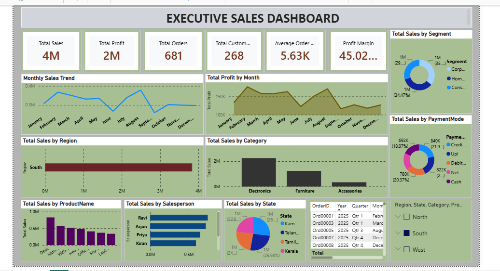

# PowerBI-Executive-Sales-Dashboard
Interactive Executive Sales Dashboard built in Power BI using DAX, Power Query, and data visualization techniques.

## Project Overview

This project presents an interactive Executive Sales Dashboard built using Microsoft Power BI. It helps analyze sales performance, profitability, customer behavior, product performance, and regional trends.

---

## Dataset

- 1,000 Sales Records
- Customer Information
- Product Details
- Regions
- Payment Modes
- Shipping Details
- Profit & Profit Margin

---

## Dashboard Features

✔ Total Sales KPI

✔ Total Profit KPI

✔ Total Orders

✔ Total Customers

✔ Average Order Value

✔ Profit Margin

✔ Monthly Sales Trend

✔ Monthly Profit Trend

✔ Sales by Region

✔ Sales by Category

✔ Sales by Segment

✔ Sales by Payment Mode

✔ Top Selling Products

✔ Interactive Filters

---

## Tools Used

- Microsoft Power BI
- Power Query
- DAX
- CSV Dataset

---

## Key DAX Measures

- Total Sales
- Total Profit
- Total Orders
- Average Order Value
- Profit Margin

---

## Dashboard Preview

---

## Files Included

- Executive_Sales_Dashboard.pbix
- powerbi_sales_portfolio_dataset_1000.csv
- dashboard.png

---

## Author

Tamilarasi Venkatesan
